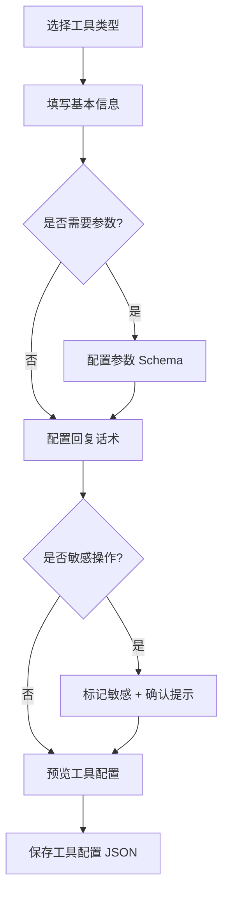

# seat-agent 架构设计

> 2026-07-10 · 基于团队讨论确定的架构决策

---

## 1. 项目定位

seat-agent 是面向客服接待场景的 **Agent Runtime**，支持文本和语音两种对话模态。

核心特性：
- **准确性优先** — RAG 必须，不幻觉，检索不到就转人工
- **速度优先** — 全链路流式，延迟有上限
- **可嵌入可独立** — 既是 Rust SDK（OCC 集成），也可作为独立 gRPC 服务运行

### 与 OCC 的关系

seat-agent 是为 [OCC（全渠道客服工作台）](https://github.com/JeeLin/OCC) 构建的 Agent Runtime 引擎。OCC 已有多租户（RLS）、Redis、gRPC（tonic）、WebSocket 等完整基础设施，seat-agent 只负责 Agent 核心逻辑。

**OCC 通过 git 依赖引用 seat-agent**：

```toml
# OCC/Cargo.toml
[workspace.dependencies]
seat-agent-core = { git = "ssh://git@ssh.github.com:443/JeeLin/seat-agent.git", path = "crates/core" }
seat-agent-tools = { git = "ssh://git@ssh.github.com:443/JeeLin/seat-agent.git", path = "crates/tools" }
seat-agent-memory = { git = "ssh://git@ssh.github.com:443/JeeLin/seat-agent.git", path = "crates/memory" }
```

本地开发时通过 `[patch]` 覆盖为本地路径，seat-agent 改动即时生效。

---

## 2. 使用模式

### 2.1 作为库（OCC 集成）

OCC 只依赖 lib crate，自己管理 gRPC / Redis / 配置：

```rust
use seat_agent_core::{Agent, AgentConfig};

let config = AgentConfig {
    modality: Modality::Text,
    max_rounds: 10,
    max_duration: Duration::from_secs(30),
    max_output_tokens: 500,
};
let mut agent = Agent::new(config).await?;
agent.register_tool(Box::new(KnowledgeSearchTool));

let response = agent.chat("我想退货").await?;
```

### 2.2 作为独立服务

直接运行 `seat-agent-server` 二进制，自带 gRPC server + Redis + 配置加载：

```bash
seat-agent-server --config agent.yaml
```

---

## 3. 仓库结构

```
seat-agent/
├── Cargo.toml                  # workspace 根配置
├── crates/
│   ├── core/                   # [lib] Agent Loop + Context + Trait 定义
│   │   └── src/
│   │       ├── agent.rs        #   Agent 主循环（Session + run_loop）
│   │       ├── context.rs      #   Context 分层模型 + token 预算
│   │       ├── config.rs       #   AgentConfig
│   │       ├── error.rs        #   错误类型
│   │       └── traits.rs       #   核心 trait 定义
│   ├── tools/                  # [lib] 工具注册 + 执行
│   │   └── src/
│   │       ├── registry.rs     #   ToolRegistry（注册 + 列表）
│   │       ├── knowledge.rs    #   内置工具：知识库检索
│   │       ├── business.rs     #   内置工具：业务系统查询
│   │       └── transfer.rs     #   内置工具：转人工
│   ├── memory/                 # [lib] 短期记忆 + 长期记忆 + 摘要生成
│   │   └── src/
│   │       ├── short_term.rs   #   短期记忆（滑动窗口）
│   │       ├── long_term.rs    #   长期记忆（向量检索）
│   │       └── summary.rs      #   会话摘要生成/修正
│   └── server/                 # [bin] 独立服务
│       └── src/
│           ├── main.rs         #   入口
│           ├── grpc.rs         #   gRPC Bidi Streaming server
│           ├── config.rs       #   ConfigProvider 实现（YAML 文件）
│           ├── redis_store.rs  #   SessionStore 实现（Redis）
│           ├── embedding.rs    #   EmbeddingClient 实现
│           ├── llm.rs          #   LlmClient 实现（reqwest）
│           └── tts.rs          #   TtsClient 实现
├── docs/
│   └── 2026-07-10-seat-agent-design.md
└── examples/
    └── basic_chat/             # SDK 模式示例
```

**职责划分**：

| crate | 类型 | 谁用 |
|---|---|---|
| `core` | lib | OCC / 任何集成方 |
| `tools` | lib | OCC / 任何集成方 |
| `memory` | lib | OCC / 任何集成方 |
| `server` | bin | 独立部署 / 演示 / 测试 |

---

## 4. Trait 抽象层

`core` crate 定义以下 trait，不依赖任何具体实现：

| Trait | 职责 | 可能的实现 |
|---|---|---|
| `LlmClient` | LLM 推理调用 | reqwest (OpenAI API) / PyO3 (litellm) |
| `EmbeddingClient` | 文本向量化 | reqwest (外部 API) / PyO3 (sentence-transformers) |
| `KnowledgeStore` | 知识库存储与检索 | 内存 HNSW / Qdrant / Milvus |
| `TtsClient` | 文本转语音 | Azure TTS / ElevenLabs / 本地 TTS |
| `Tool` | 工具定义与执行 | 各具体工具实现 |

`core` crate **零外部依赖**（除 async runtime），不 import server。PyO3 是可选实现方式，不强制依赖。

---

## 5. Context 分层模型

上下文按职责分层，**截断历史时只截 history 层**：
- system、retrieval、history_summary → 只读保护区，不可截断
- history → 滑动窗口，是唯一可截断的层
- long_term → 存储后端，支撑 retrieval 和 summary 的数据来源

```
Context
├── system: Vec<Message>              // 系统指令 + 角色设定，始终保留
├── retrieval: Vec<SearchResult>      // 当前轮预检索结果，不可截断
├── history_summary: String           // 历史会话摘要，从 long_term 加载
├── history: VecDeque<Message>        // 当前会话对话，滑动窗口截断
└── long_term: Box<dyn KnowledgeStore> // 存储后端
```

### 5.1 Token 预算分配

```
总预算 = total_token_limit
  - system 固定开销
  - history_summary（固定长度，通常 <200 token）
  - retrieval 结果（当前轮检索结果）
  ──────────────────────────
  = history 可用预算（滑动窗口截断）
```

### 5.2 截断策略

1. 先计算 system + retrieval + history_summary 的 token 总量
2. 剩余预算分配给 history
3. history 从旧到新丢弃消息，但不能低于 `min_history_messages`（默认 2 条）
4. 如果最小窗口都放不下，触发异常告警

---

## 6. 对话历史摘要机制

### 6.1 摘要生成时机

**会话结束时生成/修正摘要**，不增加实时延迟：

```
会话 N 结束
  → 将 history_summary + 当前会话 history 一起传给 LLM
  → 生成新摘要（覆盖旧摘要）
  → 存入长期记忆（向量存储）
```

### 6.2 实时矛盾解决

会话过程中遇到历史摘要信息过时的情况，**通过工具调用实时验证**：

```
客户："退款还没到账"
  ↓ 长期记忆检索 → 历史摘要："客户上次咨询退款问题"
  ↓ 工具调用 → 查询订单系统 → 退款已于03-10到账
  ↓ 回复："您的退款已于3月10日到账"
  ↓ （会话结束时摘要自然更新为新事实）
```

### 6.3 摘要存储格式

```yaml
customer_id: "CUST_12345"
session_id: "sess_20260308_refund"
created_at: "2026-03-08T14:30:00Z"
summary: "客户张三，2026-03-08 咨询订单 #12345 退款问题，已提交退款申请，等待 3-5 个工作日。"
```

---

## 7. Agent Loop 设计

### 7.1 消息队列 + 消费模型


全双工长连接下，用户消息**持续到达队列**，Agent Loop 每轮开头**一次性消费所有待处理消息**：

```rust
pub struct Session {
    message_queue: VecDeque<UserMessage>,    // 用户消息队列
    context: Context,                         // 对话上下文
    tool_registry: ToolRegistry,              // 全部工具
    agent_config: AgentConfig,                // 配置
    modality: Modality,                       // 当前模式
    is_streaming: bool,                       // 是否正在输出回复
}

impl Session {
    /// 全双工接收用户消息，加入队列
    pub fn on_message(&mut self, msg: UserMessage) {
        self.message_queue.push_back(msg);
    }

    /// Agent Loop：每轮消费所有待处理消息
    pub async fn run_loop(&mut self) -> Result<()> {
        let start_time = Instant::now();

        loop {
            // 1. 消费队列中所有待处理消息
            let queued_messages = self.drain_queue();
            if !queued_messages.is_empty() {
                self.context.history.extend(queued_messages);
            }

            // 2. 预检索（并行）
            let last_user_msg = self.context.history.back().unwrap();
            let (retrieval_results, _) = self.pre_retrieve(last_user_msg).await;
            self.context.retrieval = retrieval_results;

            // 3. 前置规则检查
            if self.context.retrieval.is_empty() {
                self.send_final_reply("抱歉，我无法回答这个问题。正在为您转接人工客服...").await;
                self.transfer_to_human().await;
                return Ok(());
            }

            // 4. 构建 Context
            let prompt = self.context.build_prompt();

            // 5. 调用 LLM，全部工具不做意图分类
            let response = self.llm.chat(&prompt, &self.tool_registry.all_tools()).await?;

            match response {
                LlmResponse::ToolCall { tool, args } => {
                    let result = self.execute_tool(tool, args).await?;
                    self.send_intermediate_reply(tool).await;
                    self.context.add_tool_result(result);

                    // 检查时间限制
                    if start_time.elapsed() > self.agent_config.max_duration {
                        self.send_final_reply("抱歉，处理时间较长，正在为您转接人工客服...").await;
                        self.transfer_to_human().await;
                        return Ok(());
                    }
                }
                LlmResponse::FinalReply { content } => {
                    self.send_final_reply(&content).await;
                    return Ok(());
                }
            }
        }
    }

    fn drain_queue(&mut self) -> Vec<UserMessage> {
        self.message_queue.drain(..).collect()
    }
}
```

### 7.2 消息消费时序

```
用户发送 M1 → 队列 [M1]
Agent Loop 启动：消费 [M1] → 预检索 → 调 LLM
  ↓
用户发送 M2 → 队列 [M2]
用户发送 M3 → 队列 [M2, M3]
  ↓
第 1 轮 LLM 返回 tool_call → 执行工具 → 中间回复 → 注入结果
  ↓
第 2 轮开始：消费 [M2, M3] → 追加到 history → 预检索 → 调 LLM
  ↓
LLM 看到完整上下文（M1 + tool_result + M2 + M3）→ 回复
```

**关键点**：
- 每轮只消费一次队列，不是每条消息触发一个 Loop
- 消息到达不打断当前轮，而是在下一轮开始时一起处理
- 工具执行期间到达的消息会被累积，下一轮一起处理

### 7.3 整体流程

```
┌─────────────────────────────────────────┐
│  Agent Loop（直到问题解决或超时）         │
│  每轮：                                  │
│  ├── 1. 消费队列中所有消息 → history     │
│  ├── 2. 预检索                           │
│  │     └── 知识库检索                    │
│  ├── 3. 前置规则检查（空 → 转人工）      │
│  ├── 4. 构建 Context                    │
│  ├── 5. 调用 LLM（全部工具）            │
│  ├── 6. LLM 返回                       │
│  │     ├── tool_call → 执行 → 中间回复  │
│  │     │   → 注入结果 → 继续下一轮      │
│  │     └── 最终回复 → 结束              │
│  └── 7. 检查时间限制 → 超时则转人工     │
└─────────────────────────────────────────┘
  ↓
  流式输出最终回复
```

### 7.4 工具注册

全部工具直接注册，不做意图分类。LLM 根据对话内容自行选择工具：

```rust
pub struct ToolRegistry {
    tools: Vec<Box<dyn Tool>>,     // 全部已注册工具
}

impl ToolRegistry {
    pub fn all_tools(&self) -> &[Box<dyn Tool>] {
        &self.tools
    }
}
```

**为什么不做意图分类**：
- 客服场景工具数量通常 6-8 个，LLM 完全能处理
- 意图分类不可能枚举完整，会漏掉工具
- Rust 规则预测不准反而限制 LLM 能力
- 如果未来工具过多，通过 OCC 按租户配置裁剪工具列表

### 7.5 中间回复提示词

工具注册时声明中间回复，按当前模态选择文本或音频，Agent 执行工具后自动输出，零 LLM 延迟：

```rust
pub struct IntermediateReply {
    pub text: Option<String>,          // "稍等，我来查一下工单信息"
    pub audio_cue: Option<String>,     // "sounds/keyboard_typing.mp3"
}
```

### 7.6 限制策略

| 限制类型 | 默认值 | 说明 |
|---|---|---|
| `max_duration` | 30s | 硬上限，超时强制转人工 |
| `max_rounds` | 10 | 软上限，防御无限循环 |
| `max_output_tokens` | 500 | 单次输出长度限制 |

**时间是真正的约束，轮次是防御。**

### 7.7 打断处理（指语音模式下的 TTS 打断）

**Agent Loop 本身不处理打断。** 打断是 TTS/传输层的问题，不是 Loop 层的问题。

| 模式 | 用户行为 | 处理方式 |
|---|---|---|
| **文字** | 用户连续输入消息 | 消息入队，下一轮 Loop 一次性消费。无需打断 |
| **语音** | TTS 正在播放时用户开口说话 | TTS 层停止播放，新语音经 ASR 转文字后入队 |

语音打断由 **TTS 层**处理（非 Loop 层）：

```
TTS 正在播放回复（文本已开始输出）
  → 用户开口说话（ASR 检测到语音活动）
  → TTS 层：停止播放
     （为了真实感可随机延迟 100-300ms 再停止）
  → ASR 识别完成 → 用户消息入队
  → Loop 下一轮消费该消息
```

Agent Loop 对所有消息一视同仁，不区分"打断"还是"正常消息"：
- 已输出的文本内容保留在 history 中（已发送给客户）
- 正在执行但未输出的工具结果也保留在 history 中
- TTS 是否被截断不影响 Loop 的行为

## 8. 输入输出设计

### 8.1 输入类型

Agent 核心只接收文本，多模态输入由上层预处理：

| 输入类型 | Agent 收到的格式 | 预处理 |
|---|---|---|
| 纯文本 | `Content::Text` | 无需处理 |
| 语音 | `Content::Text` | ASR 服务转文字（Agent 不感知） |
| 文本 + 图片 | `Content::Text + Content::Image` | 直接透传给 Vision 模型 |
| 文件/PDF | `Content::Text` | 上层系统提取文本后传入 |

```rust
pub enum Content {
    Text(String),
    Image { url: String, detail: String },
}
```

### 8.2 输出模式

```rust
pub enum OutputMode {
    Text,                           // 纯文本（文本模式）
    TextToSpeech { voice_id: Option<String> },  // 文本 + TTS（语音模式）
    Adaptive,                       // 根据输入模态自动选择
}
```

Agent Loop 核心只产出文本，TTS 在输出层按 `OutputMode` 决定是否调用。

---

## 9. gRPC 通信协议

独立服务模式下，采用 **Bidirectional Streaming**：

```protobuf
service SeatAgent {
  rpc Chat (stream ChatMessage) returns (stream ChatChunk);
}

message ChatMessage {
  string session_id = 1;
  string content = 2;
  Modality modality = 3;
}

message ChatChunk {
  oneof payload {
    string token = 1;           // 流式文本 token
    AudioCue audio = 2;         // 语音输出（TTS / 中间提示音）
    ToolEvent tool_event = 3;   // 工具调用事件
    ChatEnd end = 4;            // 对话结束信号
  }
}

message AudioCue {
  string cue_id = 1;
  bytes audio_data = 2;
}

enum Modality { TEXT = 0; VOICE = 1; }
```

---

## 10. 会话管理

### 10.1 连接即会话

独立服务模式下，每个 gRPC 双向流连接 = 一个会话。同一客户同一时间只允许一个连接，新消息到达时直接入队，不取消当前 Agent Loop。

### 10.2 会话持久化

独立服务模式下，Redis 存储会话信息（context 快照），每轮 Agent Loop 结束后异步写入。OCC 集成模式下，由 OCC 自己的 Redis 基础设施负责。

### 10.3 断线恢复

```
连接断开 → 节点保留会话状态 30s
  → 客户重连，携带 session_id
  → 从 Redis 加载 session → 重新进入 Agent Loop
  → 30s 内未重连 → 会话过期，摘要异步生成
```
### 10.4 语音模式下的 TTS 打断

**不是 Loop 层的功能**。TTS 层检测到用户开口说话（ASR 语音活动检测）后停止播放，新消息经 ASR 转文字后入队。Agent Loop 对打断无感知，按队列正常消费即可。
---

## 11. 硬性约束

1. **Rust 依赖声明在根 Cargo.toml**，子 crate 用 `workspace = true`
2. **Domain 层零外部依赖**：core crate 不依赖 server/infra
3. **全链路流式**：Agent 响应天然是 token 流，不是完整字符串
4. **不幻觉**：检索不到知识时，必须转人工或明确告知，不编造
5. **Context 截断安全**：永远只截断 history 层，system/retrieval/summary 不可截断
6. **单会话单节点**：一次会话的 Agent Loop 在单个节点内存中运行，不跨节点
7. **输出长度限制**：客服场景要求简洁，单次回复不超过 max_output_tokens

---

## 12. 延迟预算

| 阶段 | 目标延迟 | 实现方式 |
|---|---|---|
| 预检索 | <200ms | 知识库向量检索 |
| LLM 首 token | <500ms | 流式，首次 chunk 到达即开始输出 |
| 工具执行 | <500ms | 工具自身实现需满足，超时则跳过 |
| 中间回复 | 0ms | 模板注入，不调 LLM |
| 会话摘要生成 | 不计入响应延迟 | 会话结束后异步执行 |

---

## 13. 待讨论项

- [ ] 监控与可观测性（tracing/metrics）
- [ ] OCC 集成方式（git 依赖的 patch 配置）

---

## 14. 跨语言 SDK 方案

### 14.1 方案对比

| 方案 | 复杂度 | 语言支持 | 性能 | 说明 |
|---|---|---|---|---|
| **Rust SDK（lib crate）** | 低 | Rust only | 最好 | OCC 直接依赖 |
| **gRPC API（bin crate）** | 低 | 任意语言 | 好（网络开销） | proto 生成客户端 |
| **FFI（C ABI）** | 高 | 需要每种语言 binding | 最好 | 不推荐 |
| **PyO3（Python）** | 中 | Python | 好（进程内） | Python 生态集成 |

### 14.2 推荐方案

**gRPC 已经是跨语言方案**，不需要额外提供其他语言 SDK：

- **Rust（OCC）**：直接依赖 lib crate，零开销
- **其他语言（Java/Python/Go）**：通过 gRPC 调用 seat-agent-server

### 14.3 使用方式

```
seat-agent/
├── crates/
│   ├── core/          ← Rust 调用方（OCC）直接依赖
│   ├── tools/
│   ├── memory/
│   └── server/        ← 其他语言通过 gRPC 调用
└── proto/
    └── seat_agent.proto  ← 其他语言生成客户端
```

| 调用方语言 | 对接方式 | 开销 | 说明 |
|---|---|---|---|
| **Rust（OCC）** | lib crate | 零 | 直接依赖 `seat-agent-core` |
| **Rust（独立）** | bin（gRPC） | 网络 | 调用 `seat-agent-server` |
| **Java** | bin（gRPC） | 网络 | `protoc --java_out=. seat_agent.proto` |
| **Python** | bin（gRPC） | 网络 | `python -m grpc_tools.protoc` |
| **Go** | bin（gRPC） | 网络 | `protoc --go_out=. seat_agent.proto` |

### 14.4 生成客户端示例

```bash
# Python
python -m grpc_tools.protoc -I protos --python_out=. protos/seat_agent.proto

# Java
protoc --java_out=. protos/seat_agent.proto

# Go
protoc --go_out=. protos/seat_agent.proto
```

### 14.5 为什么不需要额外 SDK

1. **gRPC 已经是跨语言方案**：proto 文件生成任意语言客户端，seat-agent-server 已经实现
2. **OCC 是 Rust**：直接用 lib crate，不需要跨语言
3. **保持简单**：v1 只维护 Rust SDK，gRPC API 是自然产物
4. **如果需要 Python SDK**：可以用 PyO3 绑定（seat-agent 已经支持 PyO3 可选）

---

## 15. 配置文件设计（server crate）

### 15.1 配置文件结构

```yaml
# agent.yaml — seat-agent-server 启动配置

server:
  listen: "0.0.0.0:50051"
  max_connections: 1000

llm:
  type: "openai"                      # 或 "anthropic"、"ollama"、"custom"
  endpoint: "https://api.openai.com/v1"
  api_key: "${OPENAI_API_KEY}"        # 环境变量引用
  model: "gpt-4o"
  temperature: 0.7
  timeout: 30s

knowledge:
  type: "qdrant"                      # 或 "memory"（内存测试用）
  endpoint: "http://localhost:6333"
  collection: "knowledge_base"

memory:
  type: "redis"                       # 或 "memory"（内存测试用）
  endpoint: "redis://localhost:6379"
  ttl: 3600

tools:
  - name: "knowledge_search"
    enabled: true
  - name: "order_query"
    enabled: true
  - name: "refund_apply"
    enabled: true
  - name: "transfer_to_human"
    enabled: true

agent:
  modality: "text"                    # "text" 或 "voice"
  max_rounds: 10
  max_duration: "30s"
  max_output_tokens: 500
```

### 15.2 配置结构定义

```rust
// server/src/config.rs

#[derive(Deserialize)]
pub struct ServerConfig {
    pub listen: String,
    pub max_connections: Option<usize>,
}

#[derive(Deserialize)]
pub struct LlmConfig {
    pub r#type: String,
    pub endpoint: String,
    pub api_key: String,
    pub model: String,
    pub temperature: Option<f32>,
    pub timeout: Option<Duration>,
}

#[derive(Deserialize)]
pub struct KnowledgeConfig {
    pub r#type: String,
    pub endpoint: String,
    pub collection: Option<String>,
}

#[derive(Deserialize)]
pub struct MemoryConfig {
    pub r#type: String,
    pub endpoint: String,
    pub ttl: Option<u64>,
}

#[derive(Deserialize)]
pub struct ToolConfig {
    pub name: String,
    pub enabled: bool,
}

#[derive(Deserialize)]
pub struct AgentConfigFile {
    pub server: ServerConfig,
    pub llm: LlmConfig,
    pub knowledge: KnowledgeConfig,
    pub memory: MemoryConfig,
    pub tools: Vec<ToolConfig>,
    pub agent: AgentConfig,
}
```

### 15.3 启动流程

```rust
// server/src/main.rs

#[tokio::main]
async fn main() {
    // 1. 读取配置文件
    let config_path = std::env::args().nth(1).unwrap_or("agent.yaml".into());
    let config = load_config(&config_path);

    // 2. 根据配置创建 LLM client
    let llm: Box<dyn LlmClient> = match config.llm.r#type.as_str() {
        "openai" => Box::new(OpenAiLlmClient::new(&config.llm)),
        "anthropic" => Box::new(AnthropicLlmClient::new(&config.llm)),
        "ollama" => Box::new(OllamaLlmClient::new(&config.llm)),
        _ => panic!("Unknown LLM type"),
    };

    // 3. 根据配置创建 KnowledgeStore
    let knowledge: Box<dyn KnowledgeStore> = match config.knowledge.r#type.as_str() {
        "qdrant" => Box::new(QdrantKnowledge::new(&config.knowledge)),
        "memory" => Box::new(MemoryKnowledge::new()),
        _ => panic!("Unknown knowledge type"),
    };

    // 4. 根据配置创建 MemoryStore
    let memory: Box<dyn MemoryStore> = match config.memory.r#type.as_str() {
        "redis" => Box::new(RedisMemory::new(&config.memory)),
        "memory" => Box::new(MemoryMemory::new()),
        _ => panic!("Unknown memory type"),
    };

    // 5. 创建 Agent
    let mut agent = Agent::new(config.agent.clone(), llm);
    agent.set_knowledge(knowledge);
    agent.set_memory(memory);

    // 6. 注册工具
    for tool_config in &config.tools {
        if tool_config.enabled {
            match tool_config.name.as_str() {
                "knowledge_search" => agent.register_tool(Box::new(KnowledgeSearchTool)),
                "order_query" => agent.register_tool(Box::new(OrderQueryTool)),
                // ...
            }
        }
    }

    // 7. 启动 gRPC server
    let grpc_server = GrpcServer::new(agent, &config.server);
    grpc_server.serve().await;
}
```

### 15.4 环境变量支持

配置文件支持 `${ENV_VAR}` 语法：

```rust
// server/src/config.rs

fn expand_env_vars(s: &str) -> String {
    let re = regex::Regex::new(r"\$\{(\w+)\}").unwrap();
    re.replace_all(s, |caps: &regex::Captures| {
        let var_name = &caps[1];
        std::env::var(var_name).unwrap_or_default()
    }).to_string()
}
```

### 15.5 运行方式

```bash
# 默认配置
seat-agent-server

# 指定配置文件
seat-agent-server --config /etc/agent/agent.yaml

# 命令行参数覆盖
seat-agent-server --config agent.yaml --llm-model gpt-4-turbo

# 环境变量
export OPENAI_API_KEY=sk-xxx
seat-agent-server --config agent.yaml
```

### 15.6 配置层划分

| 层 | 配置来源 | 谁负责 |
|---|---|---|
| **core crate** | `AgentConfig`（行为配置） | 调用方传入 |
| **server crate** | `agent.yaml`（完整配置） | 启动时读取 |
| **LLM 连接** | 配置文件 `llm` 部分 | server crate 实现 |
| **工具注册** | 配置文件 `tools` 部分 | server crate 按配置注册 |

### 15.7 存储实现切换

#### MemoryStore 切换

```yaml
memory:
  type: "redis"                       # 或 "memory"
  endpoint: "redis://localhost:6379"  # Redis 时必填
  password: "${REDIS_PASSWORD}"       # 可选
  database: 0                         # 可选
  ttl: 3600                           # 默认过期时间（秒）
```

```rust
// server/src/memory.rs

/// 内存实现（测试/开发用）
pub struct MemoryMemory {
    store: Arc<RwLock<HashMap<String, (String, Instant)>>>,
}

#[async_trait]
impl MemoryStore for MemoryMemory {
    async fn save(&self, key: &str, value: &str, ttl: Option<Duration>) -> Result<()> {
        let mut store = self.store.write().await;
        let expiry = ttl.map(|d| Instant::now() + d).unwrap_or(Instant::now() + Duration::from_secs(86400));
        store.insert(key.to_string(), (value.to_string(), expiry));
        Ok(())
    }

    async fn load(&self, key: &str) -> Result<Option<String>> {
        let store = self.store.read().await;
        match store.get(key) {
            Some((value, expiry)) if *expiry > Instant::now() => Ok(Some(value.clone())),
            _ => Ok(None),
        }
    }

    async fn delete(&self, key: &str) -> Result<()> {
        let mut store = self.store.write().await;
        store.remove(key);
        Ok(())
    }
}

/// Redis 实现（生产环境）
pub struct RedisMemory {
    client: redis::Client,
    ttl: Duration,
}

#[async_trait]
impl MemoryStore for RedisMemory {
    async fn save(&self, key: &str, value: &str, ttl: Option<Duration>) -> Result<()> {
        let mut conn = self.client.get_async_connection().await?;
        let ttl = ttl.unwrap_or(self.ttl);
        redis::cmd("SETEX")
            .arg(key)
            .arg(ttl.as_secs())
            .arg(value)
            .query_async(&mut conn)
            .await?;
        Ok(())
    }

    async fn load(&self, key: &str) -> Result<Option<String>> {
        let mut conn = self.client.get_async_connection().await?;
        let value: Option<String> = redis::cmd("GET")
            .arg(key)
            .query_async(&mut conn)
            .await?;
        Ok(value)
    }

    async fn delete(&self, key: &str) -> Result<()> {
        let mut conn = self.client.get_async_connection().await?;
        redis::cmd("DEL")
            .arg(key)
            .query_async(&mut conn)
            .await?;
        Ok(())
    }
}
```

#### KnowledgeStore 切换

```yaml
knowledge:
  type: "qdrant"                      # 或 "memory"
  endpoint: "http://localhost:6333"
  collection: "knowledge_base"
```

```rust
// server/src/knowledge.rs

pub struct QdrantKnowledge { ... }   // 生产环境
pub struct MemoryKnowledge { ... }   // 测试/开发
```

#### 使用场景

| 场景 | Memory 配置 | Knowledge 配置 | 说明 |
|---|---|---|---|
| **本地开发** | `type: "memory"` | `type: "memory"` | 零依赖，重启后清空 |
| **单元测试** | `type: "memory"` | `type: "memory"` | 快速，无外部依赖 |
| **单机部署** | `type: "redis"` | `type: "qdrant"` | 本机服务 |
| **多节点部署** | `type: "redis"` | `type: "qdrant"` | 共享集群 |
| **K8s 部署** | `type: "redis"` | `type: "qdrant"` | Operator |

#### 启动逻辑

```rust
// server/src/main.rs

let memory: Box<dyn MemoryStore> = match config.memory.r#type.as_str() {
    "redis" => Box::new(RedisMemory::new(&config.memory)?),
    "memory" => Box::new(MemoryMemory::new()),
    _ => panic!("Unknown memory type: {}", config.memory.r#type),
};

let knowledge: Box<dyn KnowledgeStore> = match config.knowledge.r#type.as_str() {
    "qdrant" => Box::new(QdrantKnowledge::new(&config.knowledge)?),
    "memory" => Box::new(MemoryKnowledge::new()),
    _ => panic!("Unknown knowledge type: {}", config.knowledge.r#type),
};
```

---

## 16. 工具结构化定义

### 16.1 设计原则

- 所有工具配置必须**结构化**，方便页面表单生成
- 使用 JSON Schema 描述参数，前端自动生成表单
- 工具元信息（名称、描述、分类）统一管理
- 支持导入/导出工具配置（JSON 格式）

### 16.2 工具配置 JSON 格式

```json
{
  "tools": [
    {
      "name": "knowledge_search",
      "display_name": "知识库检索",
      "description": "搜索知识库获取答案",
      "category": "info_query",
      "enabled": true,
      "parameters": {
        "type": "object",
        "properties": {
          "query": {
            "type": "string",
            "description": "搜索关键词或问题描述",
            "min_length": 1,
            "max_length": 500
          }
        },
        "required": ["query"]
      },
      "intermediate_reply": {
        "text": "正在查阅知识库...",
        "audio_cue": "sounds/keyboard_typing.mp3"
      },
      "error_reply": "抱歉，知识库查询暂时不可用"
    },
    {
      "name": "order_query",
      "display_name": "订单查询",
      "description": "根据订单号或手机号查询订单状态",
      "category": "info_query",
      "enabled": true,
      "parameters": {
        "type": "object",
        "properties": {
          "order_id": {
            "type": "string",
            "description": "订单号",
            "pattern": "^[0-9]{10,20}$"
          },
          "phone": {
            "type": "string",
            "description": "客户手机号",
            "pattern": "^1[3-9][0-9]{9}$"
          }
        },
        "anyOf": [
          { "required": ["order_id"] },
          { "required": ["phone"] }
        ]
      },
      "intermediate_reply": {
        "text": "稍等，我来帮您查一下订单信息...",
        "audio_cue": "sounds/keyboard_typing.mp3"
      },
      "error_reply": "抱歉，订单查询暂时不可用"
    },
    {
      "name": "refund_apply",
      "display_name": "申请退款",
      "description": "为客户申请退款",
      "category": "action",
      "enabled": true,
      "sensitive": true,
      "parameters": {
        "type": "object",
        "properties": {
          "order_id": {
            "type": "string",
            "description": "要退款的订单号"
          },
          "reason": {
            "type": "string",
            "description": "退款原因",
            "min_length": 2,
            "max_length": 500
          }
        },
        "required": ["order_id", "reason"]
      },
      "intermediate_reply": {
        "text": "正在为您提交退款申请...",
        "audio_cue": "sounds/processing.mp3"
      },
      "error_reply": "抱歉，退款申请暂时不可用"
    },
    {
      "name": "transfer_to_human",
      "display_name": "转人工客服",
      "description": "转接人工客服",
      "category": "transfer",
      "enabled": true,
      "parameters": {
        "type": "object",
        "properties": {
          "reason": {
            "type": "string",
            "description": "转人工原因（内部记录）"
          },
          "reply": {
            "type": "string",
            "description": "回复给客户的话术（委婉专业）"
          }
        },
        "required": ["reason", "reply"]
      },
      "intermediate_reply": {
        "text": "正在为您转接，请稍候...",
        "audio_cue": "sounds/ringing.mp3"
      },
      "error_reply": "转接暂时不可用"
    }
  ]
}
```

### 16.3 工具分类

| 分类 | 英文标识 | 说明 |
|---|---|---|
| 信息查询 | `info_query` | 只读查询，无副作用 |
| 行为操作 | `action` | 会产生实际影响 |
| 转人工 | `transfer` | 转接人工客服 |
| 辅助 | `utility` | 格式化、翻译等辅助功能 |

### 16.4 工具字段说明

| 字段 | 类型 | 必填 | 说明 |
|---|---|---|---|
| `name` | string | ✅ | 工具唯一标识（英文，下划线分隔） |
| `display_name` | string | ✅ | 页面显示名称（中文） |
| `description` | string | ✅ | 工具描述（LLM 使用） |
| `category` | enum | ✅ | 分类（info_query/action/transfer/utility） |
| `enabled` | bool | ✅ | 是否启用 |
| `sensitive` | bool | ❌ | 是否涉及敏感操作（默认 false） |
| `parameters` | JSON Schema | ✅ | 参数定义（遵循 JSON Schema 标准） |
| `intermediate_reply` | object | ❌ | 中间回复（零延迟） |
| `error_reply` | string | ❌ | 执行失败时的回复话术 |

### 16.5 JSON Schema 参数规则

| 类型 | 支持字段 | 说明 |
|---|---|---|
| `string` | `min_length`, `max_length`, `pattern` | 支持正则校验 |
| `number` | `minimum`, `maximum` | 数值范围 |
| `enum` | `enum` | 枚举值列表 |
| `array` | `items`, `min_items`, `max_items` | 数组类型 |

#### 参数校验示例

```json
{
  "phone": {
    "type": "string",
    "description": "手机号",
    "pattern": "^1[3-9][0-9]{9}$",
    "min_length": 11,
    "max_length": 11
  },
  "amount": {
    "type": "number",
    "description": "金额",
    "minimum": 0.01,
    "maximum": 99999.99
  },
  "status": {
    "type": "string",
    "description": "状态",
    "enum": ["pending", "processing", "completed", "failed"]
  }
}
```

### 16.6 页面配置流程



### 16.7 工具配置导入/导出

```rust
// tools/src/registry.rs

pub struct ToolConfig {
    pub name: String,
    pub display_name: String,
    pub description: String,
    pub category: String,
    pub enabled: bool,
    pub sensitive: bool,
    pub parameters: serde_json::Value,  // JSON Schema
    pub intermediate_reply: Option<IntermediateReply>,
    pub error_reply: Option<String>,
}

impl ToolRegistry {
    /// 从 JSON 导入工具配置
    pub fn from_json(json: &str) -> Result<Self> {
        let config: ToolConfigFile = serde_json::from_str(json)?;
        let mut registry = Self::new();

        for tool_config in config.tools {
            registry.register_tool_config(tool_config);
        }

        Ok(registry)
    }

    /// 导出工具配置为 JSON
    pub fn to_json(&self) -> Result<String> {
        let config = ToolConfigFile {
            tools: self.tools.values().cloned().collect(),
        };
        Ok(serde_json::to_string_pretty(&config)?)
    }
}
```

### 16.8 页面表单自动生成

前端根据 JSON Schema 自动生成配置表单：

```typescript
// 页面表单生成逻辑

interface ToolParameter {
  type: 'string' | 'number' | 'enum' | 'array';
  description: string;
  min_length?: number;
  max_length?: number;
  pattern?: string;
  minimum?: number;
  maximum?: number;
  enum?: string[];
  items?: ToolParameter;
}

function generateFormFromSchema(schema: JSONSchema) {
  const fields = schema.properties;
  const required = schema.required || [];

  return Object.entries(fields).map(([name, param]) => ({
    name,
    label: param.description,
    type: getFormType(param),
    required: required.includes(name),
    validation: getValidation(param),
  }));
}

function getFormType(param: ToolParameter) {
  switch (param.type) {
    case 'string':
      if (param.enum) return 'select';
      if (param.pattern?.includes('^1')) return 'phone';
      return 'text';
    case 'number':
      return 'number';
    case 'array':
      return 'tags';
    default:
      return 'text';
  }
}
```

---

## 17. Feature 控制与可选依赖

### 17.1 设计原则

- 核心功能（Agent Loop、Context）**无外部依赖**
- 所有外部服务通过 **Feature 开关**控制
- 默认只包含内存实现（测试/开发）
- 生产依赖按需启用，减小二进制体积
- 编译时检查缺失 Feature，给出友好提示

### 17.2 Feature 列表

| Feature | 依赖 | 说明 | 默认 |
|---|---|---|---|
| `in_memory` | 无 | 内存向量库 + 内存存储 | ✅ |
| `qdrant` | `qdrant-client` | Qdrant 向量库 | ❌ |
| `milvus` | `milvus-rs` | Milvus 向量库 | ❌ |
| `chroma` | `chroma-client` | ChromaDB 向量库 | ❌ |
| `pgvector` | `sqlx` | PostgreSQL pgvector | ❌ |
| `redis` | `redis` | Redis 存储 | ❌ |
| `openai` | `reqwest` | OpenAI LLM | ❌ |
| `anthropic` | `reqwest` | Anthropic LLM | ❌ |
| `ollama` | `reqwest` | Ollama 本地 LLM | ❌ |
| `python` | `pyo3` | Python 绑定 | ❌ |

### 17.3 Cargo.toml 配置

```toml
# crates/server/Cargo.toml

[features]
default = ["in_memory"]

# 向量数据库
qdrant = ["dep:qdrant-client"]
milvus = ["dep:milvus-rs"]
chroma = ["dep:chroma-client"]
pgvector = ["dep:sqlx", "dep:sqlx-postgres"]

# LLM 提供商
openai = ["dep:reqwest"]
anthropic = ["dep:reqwest"]
ollama = ["dep:reqwest"]

# 存储
redis = ["dep:redis"]

# Python 绑定
python = ["dep:pyo3"]

[dependencies]
# 向量数据库（可选）
qdrant-client = { version = "1", optional = true }
milvus-rs = { version = "0.3", optional = true }
chroma-client = { version = "0.4", optional = true }
sqlx = { version = "0.7", features = ["runtime-tokio"], optional = true }

# HTTP 客户端（LLM 调用）
reqwest = { version = "0.11", features = ["json", "stream"], optional = true }

# 存储
redis = { version = "0.23", features = ["tokio-comp"], optional = true }

# Python（可选）
pyo3 = { version = "0.20", optional = true }

# 核心依赖（无 feature 依赖）
serde = { version = "1", features = ["derive"] }
serde_json = "1"
async-trait = "0.1"
tokio = { version = "1", features = ["full"] }
tracing = "0.1"
```

### 17.4 构建命令

```bash
# 默认（仅内存，测试用）
cargo build --workspace

# 生产环境（Qdrant + Redis + OpenAI）
cargo build --workspace --features "qdrant,redis,openai"

# Milvus 版本
cargo build --workspace --features "milvus,redis,openai"

# pgvector 版本（已有 PostgreSQL）
cargo build --workspace --features "pgvector,redis,anthropic"

# 轻量版（ChromaDB + 内存）
cargo build --workspace --features "chroma"

# 完整版（所有功能）
cargo build --workspace --features "qdrant,milvus,chroma,pgvector,redis,openai,anthropic,ollama"
```

### 17.5 向量数据库抽象

```rust
// crates/core/src/traits.rs

#[async_trait]
pub trait VectorStore: Send + Sync {
    async fn upsert(&self, id: &str, embedding: &[f32], metadata: HashMap<String, Value>) -> Result<()>;
    async fn search(&self, embedding: &[f32], limit: usize, filter: Option<Filter>) -> Result<Vec<SearchResult>>;
    async fn delete(&self, id: &str) -> Result<()>;
    async fn count(&self) -> Result<usize>;
}
```

### 17.6 各实现条件编译

```rust
// crates/server/src/vector_store.rs

#[cfg(feature = "qdrant")]
pub mod qdrant {
    use super::*;

    pub struct QdrantVectorStore { /* ... */ }

    #[async_trait]
    impl VectorStore for QdrantVectorStore { /* ... */ }
}

#[cfg(feature = "milvus")]
pub mod milvus {
    use super::*;

    pub struct MilvusVectorStore { /* ... */ }

    #[async_trait]
    impl VectorStore for MilvusVectorStore { /* ... */ }
}

#[cfg(feature = "pgvector")]
pub mod pgvector {
    use super::*;

    pub struct PgVectorStore { /* ... */ }

    #[async_trait]
    impl VectorStore for PgVectorStore { /* ... */ }
}

pub mod in_memory {
    use super::*;

    pub struct InMemoryVectorStore { /* ... */ }

    #[async_trait]
    impl VectorStore for InMemoryVectorStore { /* ... */ }
}
```

### 17.7 工厂函数

```rust
// crates/server/src/vector_store.rs

pub fn create_vector_store(config: &VectorStoreConfig) -> Result<Box<dyn VectorStore>> {
    match config.r#type.as_str() {
        #[cfg(feature = "qdrant")]
        "qdrant" => Ok(Box::new(qdrant::QdrantVectorStore::new(config)?)),

        #[cfg(feature = "milvus")]
        "milvus" => Ok(Box::new(milvus::MilvusVectorStore::new(config)?)),

        #[cfg(feature = "pgvector")]
        "pgvector" => Ok(Box::new(pgvector::PgVectorStore::new(config)?)),

        "in_memory" | _ => Ok(Box::new(in_memory::InMemoryVectorStore::new())),
    }
}
```

### 17.8 编译时检查

```rust
// crates/server/src/main.rs

fn check_features() {
    #[cfg(not(any(feature = "qdrant", feature = "milvus", feature = "pgvector")))]
    tracing::warn!("未配置向量数据库，仅使用内存模式");

    #[cfg(not(feature = "redis"))]
    tracing::warn!("未配置 Redis，会话存储使用内存模式");

    #[cfg(not(any(feature = "openai", feature = "anthropic", feature = "ollama")))]
    tracing::warn!("未配置 LLM 提供商，请在配置文件中指定");
}
```

### 17.9 配置文件对应

```yaml
# agent.yaml

vector_store:
  type: "qdrant"                      # 或 milvus/pgvector/in_memory
  endpoint: "http://localhost:6333"
  collection: "knowledge_base"
  dimension: 1536                     # 向量维度

memory:
  type: "redis"                       # 或 memory
  endpoint: "redis://localhost:6379"

llm:
  type: "openai"                      # 或 anthropic/ollama
  endpoint: "https://api.openai.com/v1"
  api_key: "${OPENAI_API_KEY}"
  model: "gpt-4o"
```
---

## 18. 转人工规则与话术设计


### 18.1 转人工触发条件

| 条件 | 触发时机 | 由谁判断 |
|---|---|---|
| **客户明确要求** | 任何时候 | LLM |
| **工具连续失败** | Agent Loop 中 | Agent 核心 |
| **知识库无结果 + LLM 不确定** | 预检索 + LLM 决策 | Agent 核心 |
| **敏感操作** | 工具调用前 | 工具定义 |
| **超时** | Agent Loop 超时 | Agent 核心 |
| **对话循环** | 轮次过多 | Agent 核心 |

### 18.2 不应转人工的场景

| 场景 | 为什么 | 正确做法 |
|---|---|---|
| 客户说"算了" | 可能只是放弃当前问题 | LLM 理解后回复 |
| 工具返回"无结果" | 可能是查询条件不对 | LLM 追问或换工具 |
| 客户追问 | 正常多轮对话 | 继续 Agent Loop |
| 客户说"不明白" | 需要解释 | LLM 换个说法 |
| 客户情绪波动 | LLM 不擅长判断情绪 | 不以此为转人工依据 |

### 18.3 Agent 核心自动转人工规则

```rust
// core/src/agent.rs

impl Agent {
    async fn check_auto_transfer(&self, context: &Context) -> Option<String> {
        // 工具连续失败 3 次
        if context.tool_failures >= 3 {
            return Some("工具调用连续失败3次".into());
        }

        // 检索结果为空 + LLM 不确定
        if context.retrieval.is_empty() && context.llm_uncertainty > 0.8 {
            return Some("知识库无结果，LLM 无法确定答案".into());
        }

        // 对话轮次过多
        if context.turn_count > 15 {
            return Some("对话轮次过多，可能陷入循环".into());
        }

        None
    }
}
```

### 18.4 敏感操作列表

```rust
const SENSITIVE_ACTIONS: &[&str] = &[
    "修改订单金额",
    "删除账号",
    "退款到其他账户",
    "修改用户信息",
    "删除订单",
    "取消已发货订单",
];
```

### 18.5 转人工话术设计

#### 原则

1. 所有对外话术必须**委婉、专业、有温度**
2. 不暴露内部逻辑（不说明真实原因）
3. 使用"您"、"为您"、"专属客服"等词汇

#### 话术对比

| 场景 | 直白（❌） | 专业（✅） |
|---|---|---|
| 客户明确要求 | "好的，转人工" | "好的，为您转接专属客服" |
| 敏感操作 | "这个我处理不了" | "这个操作需要专员为您处理" |
| 工具失败 | "系统出错了" | "正在为您查询，请稍候" |
| 超时 | "处理时间太长了" | "您的问题正在加急处理中" |

#### 中间回复话术

| 工具 | 中间回复 |
|---|---|
| knowledge_search | "正在查阅知识库..." |
| order_query | "稍等，我来帮您查一下订单信息..." |
| refund_apply | "正在为您提交退款申请..." |
| transfer_to_human | "正在为您转接，请稍候..." |

### 18.6 转人工工具设计

```rust
pub struct TransferToHumanTool;

#[async_trait]
impl Tool for TransferToHumanTool {
    fn definition(&self) -> ToolDefinition {
        ToolDefinition {
            name: "transfer_to_human".into(),
            description: "转接人工客服。仅在以下情况使用：
1. 客户明确要求转人工；
2. 涉及敏感操作（修改订单金额、删除账号、退款到其他账户等）；
3. 问题超出能力范围（需要专业技术人员介入）。
不要因为客户抱怨、追问或说"算了"就转人工。".into(),
            parameters: vec![
                ToolParameter {
                    name: "reason".into(),
                    description: "转人工原因（内部记录用，不展示给客户）".into(),
                    required: true,
                    r#type: "string".into(),
                },
                ToolParameter {
                    name: "reply".into(),
                    description: "回复给客户的话术（必须委婉、专业）".into(),
                    required: true,
                    r#type: "string".into(),
                },
            ],
            intermediate_reply: Some(IntermediateReply {
                text: "正在为您转接，请稍候...".into(),
                audio_cue: Some("sounds/ringing.mp3".into()),
            }),
        }
    }

    async fn execute(&self, args: serde_json::Value) -> Result<String> {
        let reason = args["reason"].as_str().unwrap();
        let reply = args["reply"].as_str().unwrap();

        // 内部记录原因
        tracing::info!("转人工原因: {}", reason);

        // 调用转人工 API
        // ...

        // 返回给客户的话术
        Ok(reply.to_string())
    }
}
```

### 18.7 System Prompt 话术规则

```text
你是客服助手。回复必须简洁、专业、有温度。

## 话术规则

### 转人工话术（必须委婉）
- ✅ "好的，为您转接专属客服"
- ✅ "这个操作需要专员为您处理，正在转接"
- ✅ "您的问题正在加急处理中，请稍候"
- ❌ "我处理不了，转人工"
- ❌ "系统出错了"
- ❌ "我不知道"

### 通用话术原则
1. 使用"您"而不是"你"
2. 使用"我们"而不是"我"
3. 避免负面词汇（不行、不能、不知道）
4. 用"正在为您..."代替"我需要..."
5. 用"建议您..."代替"你应该..."
```
